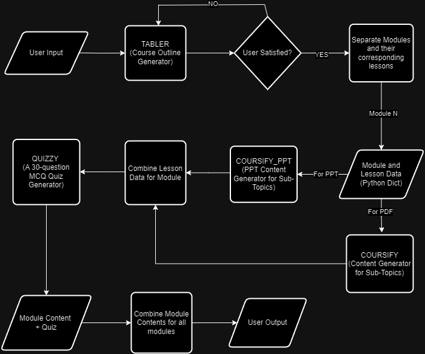

<h1 align="center">🚀 Automated Course Development (ACD) Model</h1>
<p align="center">
Empowering educators and content creators with AI-driven course design.
</p>

<p align="center">
  
  
  
  
</p>

---

## 📘 Overview

The **Automated Course Development (ACD)** Model is an AI-powered Streamlit application designed for **SMEs, content creators, and educators**.  
It enables effortless course creation by dynamically generating **course outlines, detailed modules, and quizzes** based on inputs such as *Course Name, Difficulty Level, and Number of Modules*.  

This tool not only creates **comprehensive and customizable course content**, but also allows users to **download results as neatly formatted PDFs and PPTs**.  
By leveraging advanced LLMs (like GPT and LLaMA), ACD streamlines the entire course design process — from planning to delivery — saving time while enhancing quality.

---

## 🌟 Features

- 🎨 **Dynamic Course Outline Generation**: Create customized outlines based on user-defined parameters.  
- 🧩 **Detailed Content Creation**: Automatically generate complete course modules and lessons.  
- 🧠 **AI-Powered Quiz Generation**: Get intelligently tailored quiz questions for each module.  
- 📄 **Download Options**: Export full content as **PDF** or **PPT** instantly.  
- ✏️ **Content Customization**: Edit and refine generated content as needed.  
- 💡 **Future Integration Ready**: Scalable structure to support future AI model integrations and educational imagery.  

---

## 🧭 High-Level Workflow



---

## ⚙️ Getting Started

Follow these steps to run the ACD application on your local system.

### Step 1: Generate OpenAI API Key

1. Generate your OpenAI API key.  
2. Store the key in a `.env` file with the following format:
   ```env
   OPENAI_API_KEY="your_openai_api_key_here"
   ```

### Step 2: Set Up Your Environment

1. Ensure Python is installed on your system.  
2. Open the command prompt.  
3. Create a new virtual environment:
   ```sh
   python -m venv env
   ```
4. Activate the virtual environment:
   - On Windows:
     ```sh
     .\env\Scripts\activate
     ```
   - On macOS/Linux:
     ```sh
     source env/bin/activate
     ```
5. Install required libraries:
   ```sh
   pip install -r requirements.txt
   ```

### Step 3: Run the Application

1. Navigate to the directory containing `app.py`.  
2. Run the application:
   ```sh
   streamlit run app.py
   ```

### Step 4: Access the Application

The application will open automatically in your default web browser and should run smoothly.

---

## 🔮 Upcoming Features

We are continuously improving the ACD application. Future versions will include:

- 🖼️ **Integration of Educational Imagery**: Enhance course visuals with AI-curated educational images.  
- 🤝 **Collaborative Authoring**: Multi-user editing and feedback workflows.  
- 📚 **Adaptive Learning Paths**: AI-based personalization based on learner performance and feedback.

---

## 💻 Tech Stack

- **Python** 🐍  
- **Streamlit** 🧱  
- **OpenAI API (GPT Models)** 🤖  
- **Meta’s LLaMA Models** 🦙  
- **VS Code** 💻  
- **GitHub** 🐙  

---

## 💬 Thank You

<p align="center">
  🙏 Thank you for using <b>Automated Course Development (ACD)</b>!  
</p>
<p align="center">
  For questions, feedback, or collaborations — feel free to reach out anytime.  
</p>
<p align="center">
  <i>“Empowering education through intelligent automation.”</i> ✨  
</p>
